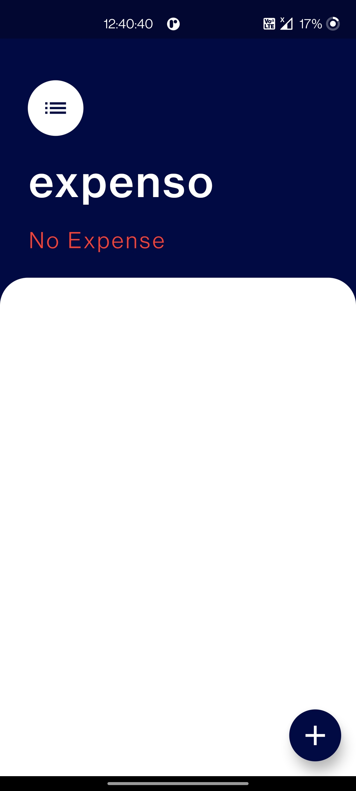
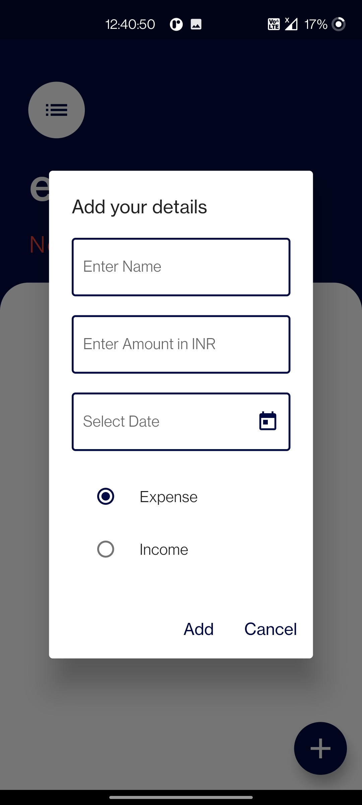
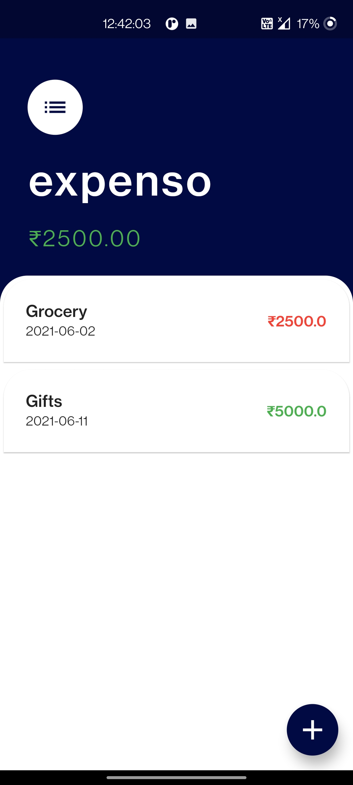

# Expenso

A Flutter application that helps to track expenses.
Database: HIVE

## Implemented Features
    Add new transactions.
    Delete transactions.
    Check total amount transactions

## Non Implemented Features
    Edit the existing transactions.

## Screenshots
App Screens:

- [Lab: Write your first Flutter app](https://flutter.dev/docs/get-started/codelab)
- [Cookbook: Useful Flutter samples](https://flutter.dev/docs/cookbook)

For help getting started with Flutter, view our
[online documentation](https://flutter.dev/docs), which offers tutorials,
samples, guidance on mobile development, and a full API reference.
